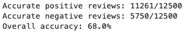

## movie-reviews-sentiment-analysis-python
In this project, I used text preprocessing and conducted sentiment analysis on a large dataset of 25,000 movie reviews with python, aiming to train my model to effectively recognize the difference between positive and negative movie reviews.

## 📘 Notebook
You can view the full code and analysis in [MovieReviewSentimentAnalysis.ipynb](./MovieReviewSentimentAnalysis.ipynb)

## 📊 Topic Modeling Results
### 🎯 Categorization Accuracy Results

## 💡 Interpretation of the Results - Patterns, Insights
Overall, it is harder to determine if a comment is negative because there are so many ambiguous words that can be used to express a reviewer's dissatisfaction with a film, because they can mention specific scenes or details about the movie that they didn't like, while for positive reviews, usually they mention the same adjectives like "amazing", "fantastic", or "great" to describe the film overall. Additionally, filtering the text in the beginning to remove all capitalization and special symbols help prevent discrepancies and misses from occurring during the process.
